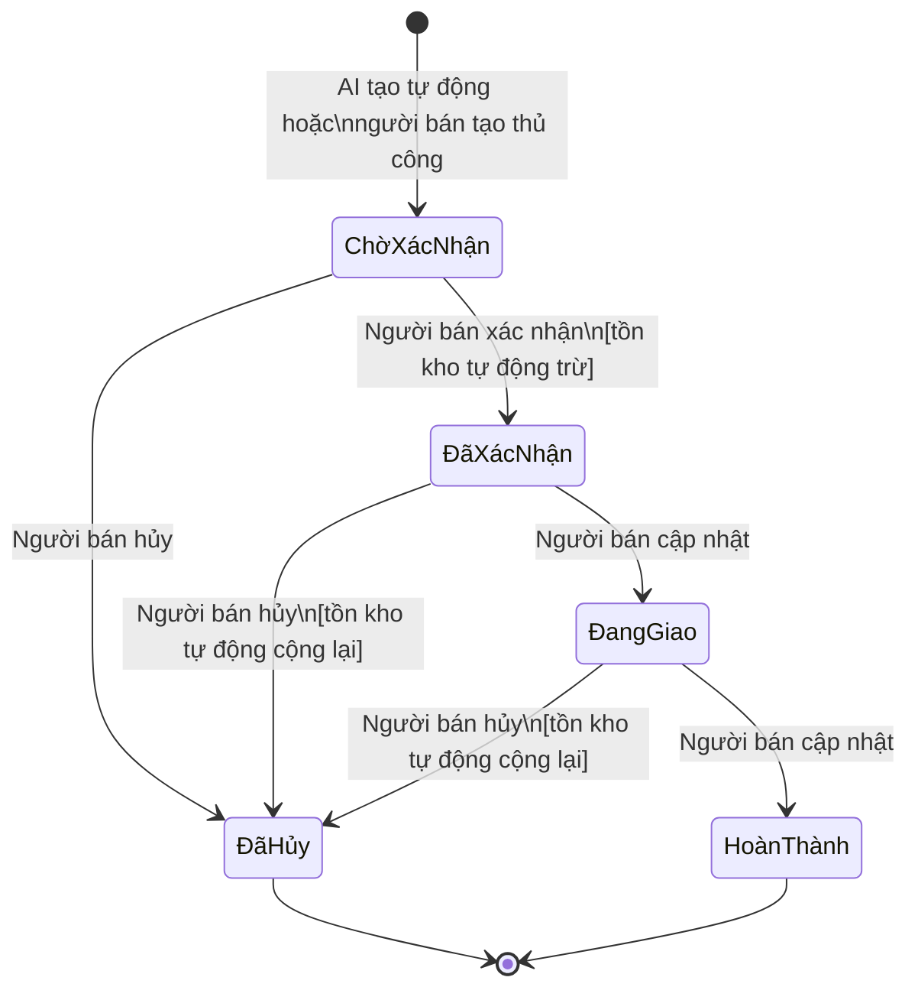

# Feature Specification: SocialCart

> **Trạng thái:** Approved  
> **Phiên bản:** 1.0  
> **Ngày tạo:** 2026-09-08  
> **Cập nhật lần cuối:** 2026-09-08  
> **Nguồn:** PRD v1.0 (Approved) + Project Context  
> **PRD tham chiếu:** [product-requirements.md](file:///g:/ChuyenDe4/SocialCart/docs/product-requirements.md)

---

## Mục lục

1. [Xác thực & Phân quyền](#1-xác-thực--phân-quyền)
2. [Kết nối nền tảng](#2-kết-nối-nền-tảng)
3. [Unified Inbox](#3-unified-inbox)
4. [Quản lý khách hàng](#4-quản-lý-khách-hàng)
5. [Quản lý sản phẩm](#5-quản-lý-sản-phẩm)
6. [AI Chatbot](#6-ai-chatbot)
7. [Quản lý đơn hàng](#7-quản-lý-đơn-hàng)
8. [Dashboard](#8-dashboard)
9. [Exclusions](#9-exclusions)

---

## 1. Xác thực & Phân quyền

> Tham chiếu: FR-31, FR-32, FR-33, FR-34 | US-15

### 1.1. Protected Access

Mọi route và API endpoint trong hệ thống đều yêu cầu session hợp lệ, ngoại trừ:
- Trang đăng nhập
- Endpoint đăng nhập (POST)

Nếu request không có session hoặc session đã hết hạn → chuyển hướng về trang đăng nhập.

### 1.2. Đăng nhập

**Business Rules:**
- BR-AUTH-01: Hệ thống hỗ trợ duy nhất 1 tài khoản người bán (single-tenant).
- BR-AUTH-02: Đăng nhập bằng email + mật khẩu.
- BR-AUTH-03: Mật khẩu phải được hash trước khi lưu trữ.

**Main Flow:**
1. Người bán truy cập hệ thống → hiển thị form đăng nhập (email, mật khẩu).
2. Nhập thông tin → nhấn "Đăng nhập".
3. Hệ thống xác thực → tạo session → chuyển đến Dashboard.

**Error Flow:**
- Email hoặc mật khẩu sai → hiển thị thông báo chung: *"Email hoặc mật khẩu không đúng"*. Không tiết lộ email có tồn tại hay không.
- Các trường bỏ trống → hiển thị lỗi validation inline.

**Validation:**
| Trường | Quy tắc |
|--------|---------|
| Email | Bắt buộc, format email hợp lệ |
| Mật khẩu | Bắt buộc, tối thiểu 8 ký tự |

**Persistence:**
- Session hết hạn sau 24 giờ không hoạt động.
- Session token không lộ ra URL.

### 1.3. Đăng xuất

**Main Flow:**
1. Người bán nhấn "Đăng xuất" trong menu.
2. Hệ thống hiển thị dialog xác nhận: *"Bạn có chắc muốn đăng xuất?"*
3. Xác nhận → session bị hủy hoàn toàn → chuyển về trang đăng nhập.
4. Mọi truy cập tiếp theo đều bị chuyển về trang đăng nhập.

**UI States:**
| State | Hiển thị |
|-------|---------|
| Chưa đăng nhập | Trang đăng nhập |
| Đã đăng nhập | Dashboard + sidebar navigation |
| Session hết hạn | Tự động chuyển về trang đăng nhập |

---

## 2. Kết nối nền tảng

> Tham chiếu: FR-01, FR-02, FR-03 | US-01, US-02

### 2.1. Business Rules

- BR-CONN-01: Hệ thống hỗ trợ kết nối **1 Facebook Page** và **1 tài khoản Zalo** (OA hoặc cá nhân).
- BR-CONN-02: Mỗi nền tảng có 3 trạng thái: `Chưa kết nối` / `Đã kết nối` / `Lỗi kết nối`.
- BR-CONN-03: Token kết nối lưu phía server, không lộ ra client.
- BR-CONN-04: Khi token hết hạn hoặc bị thu hồi → trạng thái chuyển sang `Lỗi kết nối`.

### 2.2. Kết nối Facebook Page

**Main Flow:**
1. Người bán mở trang Cài đặt → mục "Kết nối nền tảng".
2. Nhấn "Kết nối Facebook".
3. Hệ thống chuyển hướng đến luồng OAuth Facebook.
4. Người bán chọn Page và cấp quyền → hệ thống nhận token.
5. Trang Cài đặt hiển thị tên Page, trạng thái "Đã kết nối".
6. Tin nhắn mới gửi đến Page xuất hiện trong Inbox trong vòng 60 giây.

**Alternative Flow:**
- Người bán đã kết nối → nút đổi thành "Ngắt kết nối". Nhấn → dialog xác nhận: *"Ngắt kết nối sẽ dừng nhận tin nhắn mới. Dữ liệu cũ vẫn được giữ lại. Tiếp tục?"* → Xác nhận → trạng thái về `Chưa kết nối`.

**Error Flow:**
- Người bán từ chối cấp quyền → hiển thị thông báo: *"Kết nối Facebook thất bại. Vui lòng thử lại và cấp quyền cần thiết."* Trạng thái giữ `Chưa kết nối`.
- OAuth trả lỗi → hiển thị: *"Không thể kết nối. Vui lòng thử lại sau."*

### 2.3. Kết nối Zalo

**Main Flow:** Tương tự Facebook nhưng sử dụng luồng xác thực Zalo. Hỗ trợ cả Zalo OA và Zalo cá nhân. Trang Cài đặt hiển thị thêm loại tài khoản (OA / cá nhân).

**Error Flow:** Tương tự Facebook.

### 2.4. Xử lý token hết hạn

**Flow:**
1. Hệ thống phát hiện token không hợp lệ (khi gọi API nền tảng).
2. Trạng thái kết nối chuyển sang `Lỗi kết nối`.
3. Hiển thị cảnh báo: *"Kết nối [Facebook/Zalo] bị gián đoạn. Nhấn 'Kết nối lại' để khôi phục."*
4. Hệ thống dừng gửi tin nhắn qua kênh đó. Tin nhắn chưa gửi được đánh dấu lỗi.

**Persistence:**
- Dữ liệu hội thoại và khách hàng đã nhận **không bị xóa** khi ngắt kết nối.
- Tin nhắn đến sau khi ngắt kết nối sẽ **không được nhận** cho đến khi kết nối lại.

**UI States:**
| State | Hiển thị |
|-------|---------|
| Chưa kết nối | Nút "Kết nối [Platform]" |
| Đã kết nối | Tên tài khoản + badge xanh + nút "Ngắt kết nối" |
| Lỗi kết nối | Badge đỏ + thông báo lỗi + nút "Kết nối lại" |

---

## 3. Unified Inbox

> Tham chiếu: FR-04 → FR-09 | US-03, US-04, US-05

### 3.1. Business Rules

- BR-INBOX-01: Danh sách hội thoại sắp xếp theo **tin nhắn mới nhất lên trên**.
- BR-INBOX-02: Mỗi hội thoại hiển thị: avatar khách, tên khách, nền tảng badge, tin nhắn cuối cùng (rút gọn), thời gian, trạng thái AI, chỉ báo chưa đọc.
- BR-INBOX-03: Hội thoại có 3 trạng thái xử lý: `Mới` / `Đang xử lý` / `Đã xử lý`.
- BR-INBOX-04: Hội thoại có 3 trạng thái AI: `AI đang xử lý` / `Cần người bán` / `Người bán đang xử lý`.
- BR-INBOX-05: Khi người bán mở hội thoại → chỉ báo chưa đọc biến mất.

### 3.2. Danh sách hội thoại

**Main Flow:**
1. Người bán mở Inbox → hiển thị danh sách tất cả hội thoại.
2. Mỗi dòng hiển thị badge nền tảng (icon Facebook / Zalo).
3. Người bán chọn bộ lọc → danh sách lọc theo tiêu chí.

**Bộ lọc:**
| Bộ lọc | Giá trị |
|--------|---------|
| Nền tảng | Tất cả / Facebook / Zalo |
| Trạng thái | Tất cả / Mới / Đang xử lý / Đã xử lý |

**Alternative Flow:**
- Không có hội thoại nào → hiển thị empty state: *"Chưa có hội thoại. Hãy kết nối Facebook hoặc Zalo để bắt đầu."*
- Bộ lọc không có kết quả → *"Không có hội thoại nào khớp bộ lọc."*

### 3.3. Chi tiết hội thoại & Gửi tin nhắn

**Main Flow:**
1. Người bán nhấn vào hội thoại → panel chi tiết mở ra.
2. Hiển thị toàn bộ lịch sử tin nhắn theo thứ tự thời gian (cũ → mới).
3. Phân biệt rõ: tin nhắn của khách / tin nhắn của người bán / tin nhắn AI tự động.
4. Người bán nhập tin nhắn → nhấn "Gửi" hoặc Enter.
5. Tin nhắn hiển thị trong hội thoại với trạng thái "Đang gửi..." → "Đã gửi".
6. Tin nhắn được gửi đến khách qua nền tảng tương ứng.

**Error Flow:**
- Gửi thất bại (API lỗi / mất kết nối) → tin nhắn hiển thị icon lỗi + *"Gửi thất bại"* + nút "Thử lại". Tin nhắn **không** được đánh dấu là đã gửi.
- Nền tảng đang ở trạng thái `Lỗi kết nối` → disable ô nhập tin nhắn + hiển thị: *"Không thể gửi tin nhắn. Kết nối [Platform] đang bị gián đoạn."*

**Validation:**
- Tin nhắn trống → nút Gửi bị disable.

### 3.4. Trạng thái AI trong hội thoại

| Trạng thái | Ý nghĩa | Badge |
|-----------|---------|-------|
| AI đang xử lý | AI đang tự động trả lời hội thoại này | 🤖 xanh |
| Cần người bán | AI gắn cờ — cần can thiệp thủ công | 🔔 vàng |
| Người bán đang xử lý | Người bán đã tắt AI, đang tự trả lời | 👤 xám |

**Hành vi chuyển trạng thái AI:**
| Từ → Đến | Trigger |
|-----------|---------|
| AI đang xử lý → Cần người bán | AI gặp tình huống ngoài kịch bản, AI service lỗi, hoặc timeout khách không phản hồi |
| AI đang xử lý → Người bán đang xử lý | Người bán nhấn "Tắt AI" |
| Cần người bán → Người bán đang xử lý | Người bán mở hội thoại và bắt đầu trả lời |
| Người bán đang xử lý → AI đang xử lý | Người bán nhấn "Bật lại AI" |

**UI Controls:**
- Nút "Tắt AI" hiển thị khi trạng thái là `AI đang xử lý`.
- Nút "Bật lại AI" hiển thị khi trạng thái là `Người bán đang xử lý`.
- Cả hai nút thay đổi trạng thái ngay lập tức, không cần dialog xác nhận.

**Persistence:**
- Lịch sử tin nhắn lưu vĩnh viễn (không bị xóa khi đơn hàng kết thúc).
- Trạng thái đọc/chưa đọc lưu theo session người bán.

---

## 4. Quản lý khách hàng

> Tham chiếu: FR-10 → FR-13 | US-06

### 4.1. Business Rules

- BR-CUST-01: Khách hàng được nhận dạng qua **ID nền tảng** (Facebook UID / Zalo UID).
- BR-CUST-02: Một UID = một hồ sơ khách hàng. Không tạo trùng.
- BR-CUST-03: Cùng một người dùng từ 2 nền tảng khác nhau → 2 hồ sơ riêng biệt (ghép nối Out-of-Scope v1).
- BR-CUST-04: Hồ sơ tự động tạo khi khách nhắn tin lần đầu.

### 4.2. Tự động tạo hồ sơ

**Main Flow:**
1. Tin nhắn đến từ Facebook/Zalo UID chưa tồn tại.
2. Hệ thống tạo hồ sơ khách hàng tự động: tên (lấy từ profile nền tảng), nền tảng, thời gian tạo.
3. Hội thoại liên kết với hồ sơ này.

**Alternative Flow:**
- UID đã tồn tại → liên kết hội thoại mới vào hồ sơ hiện có. Không tạo hồ sơ trùng.

### 4.3. Xem hồ sơ khách hàng

**Main Flow:**
1. Từ Inbox: người bán mở hội thoại → sidebar hiển thị hồ sơ khách hàng.
2. Hoặc: người bán mở danh sách khách hàng → nhấn vào tên khách.
3. Hồ sơ hiển thị:
   - Tên khách
   - Nền tảng (Facebook / Zalo)
   - Danh sách hội thoại liên quan
   - Danh sách đơn hàng liên quan
   - Ghi chú thủ công

### 4.4. Ghi chú thủ công

**Main Flow:**
1. Trong hồ sơ khách hàng, người bán nhấn "Thêm ghi chú".
2. Nhập nội dung → nhấn "Lưu".
3. Ghi chú xuất hiện ngay, kèm thời gian tạo.
4. Ghi chú tồn tại sau khi tải lại trang.

**Validation:**
- Ghi chú trống → không cho lưu (nút Lưu disable).

**Persistence:**
- Hồ sơ khách hàng, hội thoại liên kết, ghi chú tồn tại vĩnh viễn.

---

## 5. Quản lý sản phẩm

> Tham chiếu: FR-14 → FR-16b | US-07, US-07b, US-07c

### 5.1. Business Rules

- BR-PROD-01: Sản phẩm có các trường: tên, mô tả, ảnh, trạng thái (đang bán / ngừng bán).
- BR-PROD-02: Mỗi sản phẩm **phải có ít nhất 1 biến thể** mới được đặt trạng thái "đang bán".
- BR-PROD-03: Mỗi biến thể có: tên, giá (≥ 0), tồn kho (≥ 0).
- BR-PROD-04: Tồn kho được quản lý **theo từng biến thể**, không theo sản phẩm.
- BR-PROD-05: Nếu tất cả biến thể bị xóa → sản phẩm tự động chuyển sang "ngừng bán".
- BR-PROD-06: AI chỉ sử dụng sản phẩm có trạng thái "đang bán" để tư vấn.
- BR-PROD-07: Người bán có thể cấu hình ngưỡng cảnh báo tồn kho thấp (mặc định: 0).

### 5.2. Tạo sản phẩm

**Main Flow:**
1. Người bán mở danh sách sản phẩm → nhấn "Thêm sản phẩm".
2. Điền form: tên, mô tả, ảnh (upload).
3. Thêm ít nhất 1 biến thể (tên biến thể, giá, tồn kho ban đầu).
4. Nhấn "Lưu" → sản phẩm tạo thành công, trạng thái mặc định "đang bán".

**Error Flow:**
- Thiếu tên sản phẩm → lỗi validation: *"Tên sản phẩm là bắt buộc."*
- Không có biến thể → lỗi: *"Sản phẩm cần ít nhất 1 biến thể."*
- Giá biến thể < 0 → lỗi: *"Giá không được âm."*
- Tồn kho < 0 → lỗi: *"Số lượng tồn kho không được âm."*

**Validation:**
| Trường | Quy tắc |
|--------|---------|
| Tên sản phẩm | Bắt buộc, tối đa 200 ký tự |
| Mô tả | Tùy chọn |
| Ảnh | Tùy chọn, hỗ trợ JPG/PNG, tối đa 5MB |
| Biến thể - Tên | Bắt buộc, tối đa 100 ký tự |
| Biến thể - Giá | Bắt buộc, số nguyên ≥ 0 (VNĐ) |
| Biến thể - Tồn kho | Bắt buộc, số nguyên ≥ 0 |

### 5.3. Sửa sản phẩm

**Main Flow:**
1. Người bán mở chi tiết sản phẩm → nhấn "Sửa".
2. Thay đổi thông tin → nhấn "Lưu".
3. Thay đổi được lưu ngay. AI sử dụng thông tin mới cho các hội thoại tiếp theo.

**Alternative Flow:**
- Thay đổi giá biến thể → đơn hàng cũ **giữ nguyên giá tại thời điểm đặt**. Giá mới chỉ áp dụng cho đơn hàng mới.

### 5.4. Xóa sản phẩm

**Main Flow:**
1. Người bán nhấn "Xóa" trên sản phẩm.
2. Dialog xác nhận: *"Xóa sản phẩm '[Tên]'? Hành động này không thể hoàn tác. Đơn hàng cũ liên quan đến sản phẩm này sẽ vẫn được giữ lại."*
3. Xác nhận → sản phẩm bị xóa khỏi danh sách. AI không còn tư vấn sản phẩm này.

**Business Rule:**
- Đơn hàng đã tạo **không bị ảnh hưởng** khi xóa sản phẩm. Đơn hàng giữ snapshot thông tin sản phẩm tại thời điểm đặt.

### 5.5. Quản lý biến thể

**Thêm biến thể:**
1. Trong form sản phẩm, nhấn "Thêm biến thể".
2. Nhập tên, giá, tồn kho ban đầu.
3. Nhấn "Lưu" (trong form sản phẩm).

**Sửa biến thể:** Trực tiếp trong form sản phẩm. Lưu cùng lúc với sản phẩm.

**Xóa biến thể:**
1. Nhấn "Xóa" bên cạnh biến thể.
2. Nếu đây là biến thể cuối cùng → hiển thị cảnh báo: *"Đây là biến thể cuối. Xóa sẽ chuyển sản phẩm sang 'ngừng bán'."*
3. Xác nhận → biến thể bị xóa. Sản phẩm chuyển "ngừng bán" nếu không còn biến thể.

### 5.6. Cập nhật tồn kho

**Main Flow:**
1. Người bán mở chi tiết sản phẩm.
2. Sửa số lượng tồn kho của từng biến thể.
3. Nhấn "Lưu" → tồn kho cập nhật ngay. Tổng tồn kho trong danh sách cập nhật.

**Cảnh báo tồn kho thấp:**
- Khi tồn kho biến thể ≤ ngưỡng cấu hình → hiển thị badge đỏ "Hết hàng" (hoặc "Sắp hết") trên sản phẩm trong danh sách.

### 5.7. Danh sách sản phẩm

**Hiển thị:**
- Bảng: Tên | Ảnh | Số biến thể | Tổng tồn kho | Trạng thái | Hành động
- Tìm kiếm theo tên sản phẩm (real-time filter).
- Lọc theo trạng thái: Tất cả / Đang bán / Ngừng bán.

**Empty state:** *"Chưa có sản phẩm. Nhấn 'Thêm sản phẩm' để bắt đầu."*

**Persistence:**
- Tất cả dữ liệu sản phẩm và biến thể tồn tại sau khi tải lại trang.
- Tồn kho tự động thay đổi khi đơn hàng được xác nhận/hủy (xem Module 7).

---

## 6. AI Chatbot

> Tham chiếu: FR-17 → FR-22c | US-08, US-09, US-10, US-10b, US-10c

### 6.1. Business Rules

- BR-AI-01: AI tự động trả lời tin nhắn đến trong vòng **30 giây**.
- BR-AI-02: AI sử dụng 3 nguồn: FAQ cấu hình + danh mục sản phẩm (đang bán) + kịch bản chốt đơn.
- BR-AI-03: AI **không tự xác nhận đơn hàng** — chỉ tạo đơn với trạng thái "Chờ xác nhận".
- BR-AI-04: AI **có gửi thông tin thanh toán** theo template cấu hình sẵn.
- BR-AI-05: AI **tự cập nhật** đơn hàng khi khách thay đổi (chỉ khi đơn ở trạng thái "Chờ xác nhận").
- BR-AI-06: AI không bịa thông tin — chỉ sử dụng dữ liệu từ danh mục sản phẩm và FAQ.
- BR-AI-07: Timeout khách không phản hồi: mặc định 24 giờ, người bán cấu hình được.

### 6.2. Cấu hình FAQ

**Main Flow:**
1. Người bán mở trang Cài đặt AI → mục FAQ.
2. Nhấn "Thêm FAQ" → nhập câu hỏi mẫu + câu trả lời.
3. Lưu. AI sử dụng FAQ cho các hội thoại tiếp theo.

**Sửa/Xóa FAQ:**
- Sửa: mở FAQ → thay đổi → lưu.
- Xóa: nhấn "Xóa" → dialog: *"Xóa FAQ này? AI sẽ không còn trả lời câu hỏi tương tự."* → xác nhận.

**Validation:**
| Trường | Quy tắc |
|--------|---------|
| Câu hỏi mẫu | Bắt buộc, tối đa 500 ký tự |
| Câu trả lời | Bắt buộc, tối đa 2000 ký tự |

### 6.3. Cấu hình template thanh toán

**Main Flow:**
1. Người bán mở Cài đặt AI → mục "Thông tin thanh toán".
2. Điền: số tài khoản, tên ngân hàng, tên chủ tài khoản.
3. Lưu. AI sẽ sử dụng template này khi gửi thông tin thanh toán.

**Validation:**
| Trường | Quy tắc |
|--------|---------|
| Số tài khoản | Bắt buộc, chỉ số, tối đa 20 ký tự |
| Tên ngân hàng | Bắt buộc, tối đa 100 ký tự |
| Tên chủ tài khoản | Bắt buộc, tối đa 100 ký tự |

**Business Rule:**
- Nếu chưa cấu hình template → AI **không gửi** thông tin thanh toán, chỉ tóm tắt đơn hàng.
- AI chỉ gửi đúng thông tin đã cấu hình, không bịa thêm.

### 6.4. AI xử lý tin nhắn — Main Flow

```
Tin nhắn đến từ khách
  │
  ├── Hội thoại ở trạng thái "Người bán đang xử lý"?
  │     └── YES → Không làm gì. Chờ người bán.
  │
  ├── Khớp FAQ?
  │     └── YES → Gửi câu trả lời FAQ.
  │
  ├── Khách hỏi về sản phẩm?
  │     └── YES → Tra cứu danh mục sản phẩm (đang bán).
  │           ├── Tìm thấy → Gửi thông tin sản phẩm (tên, mô tả, giá, biến thể).
  │           └── Không tìm thấy → Gửi: "Xin lỗi, sản phẩm bạn tìm chưa có trong danh mục."
  │
  ├── Khách có ý định mua?
  │     └── YES → Bắt đầu flow chốt đơn (xem 6.5).
  │
  └── Không nhận ra ý định?
        └── Gắn cờ "Cần người bán". Dừng tự động trả lời.
```

**Error Flow — AI service lỗi:**
1. AI service không phản hồi trong 30 giây.
2. Hội thoại tự động gắn cờ "Cần người bán".
3. Không gửi tin nhắn nào đến khách.
4. Inbox hiển thị cảnh báo cho người bán.

### 6.5. Flow chốt đơn

**Main Flow:**
1. AI phát hiện ý định mua → hỏi sản phẩm muốn mua.
2. Khách chọn sản phẩm → AI hỏi biến thể (nếu sản phẩm có nhiều biến thể).
3. Khách chọn biến thể → AI kiểm tra tồn kho:
   - Tồn kho > 0 → hỏi số lượng.
   - Tồn kho = 0 → *"Xin lỗi, [Biến thể] hiện đã hết hàng."* + đề xuất biến thể còn hàng.
4. Khách xác nhận số lượng → AI hỏi tên khách hàng.
5. Khách cho tên → AI hỏi số điện thoại.
6. Khách cho SĐT → AI hỏi địa chỉ giao hàng.
7. Khách cho địa chỉ → AI hiển thị tóm tắt đơn hàng:
   ```
   📋 Tóm tắt đơn hàng:
   • [Sản phẩm] - [Biến thể] x[SL] — [Giá]
   • Tổng tiền: [Tổng]
   • Giao đến: [Tên], [SĐT], [Địa chỉ]
   
   Bạn xác nhận đặt hàng không?
   ```
8. Khách xác nhận → hệ thống tạo đơn hàng trạng thái "Chờ xác nhận".
9. AI gửi thông tin thanh toán (nếu đã cấu hình template):
   ```
   💳 Thông tin thanh toán:
   • Ngân hàng: [Tên NH]
   • Số TK: [Số TK]
   • Chủ TK: [Tên chủ TK]
   • Số tiền: [Tổng tiền]
   ```
10. AI gửi: *"Đơn hàng đã được ghi nhận. Người bán sẽ xác nhận sớm nhất!"*

**Alternative Flow — Khách muốn nhiều sản phẩm:**
- Sau bước 3, AI hỏi: *"Bạn có muốn thêm sản phẩm nào khác không?"*
- Nếu có → lặp lại bước 1–3 cho sản phẩm tiếp theo.
- Nếu không → tiếp tục bước 4.

**Error Flow — Sản phẩm không tìm thấy:**
- Khách nhắn tên sản phẩm không khớp danh mục → AI: *"Xin lỗi, mình không tìm thấy sản phẩm '[tên]'. Bạn có thể mô tả rõ hơn hoặc chọn sản phẩm khác không?"*
- Sau 2 lần không khớp → gắn cờ "Cần người bán".

### 6.6. Khách thay đổi đơn hàng (FR-22c)

**Điều kiện:** Đơn hàng ở trạng thái "Chờ xác nhận".

**Main Flow:**
1. Khách nhắn yêu cầu thay đổi (ví dụ: "đổi địa chỉ", "thêm 1 cái nữa", "đổi size").
2. AI nhận ra ý định thay đổi.
3. AI cập nhật thông tin trên đơn hàng.
4. AI gửi lại tóm tắt đơn hàng đã cập nhật cho khách.

**Alternative Flow — Thay đổi biến thể/sản phẩm:**
- AI kiểm tra tồn kho biến thể mới.
- Tồn kho > 0 → cập nhật đơn, gửi tóm tắt mới.
- Tồn kho = 0 → *"Xin lỗi, [biến thể mới] hiện đã hết hàng. Đơn hàng giữ nguyên."*

**Boundary:**
- Chỉ cập nhật khi đơn ở trạng thái "Chờ xác nhận". Nếu đơn đã "Đã xác nhận" trở đi → gắn cờ "Cần người bán".

### 6.7. Timeout — Khách không phản hồi (FR-20b)

**Flow:**
1. AI đang thu thập thông tin đặt hàng (chưa đủ thông tin bắt buộc).
2. Khách ngừng trả lời.
3. Sau khoảng thời gian cấu hình (mặc định: 24 giờ):
   - Hội thoại chuyển về trạng thái "chưa xử lý".
   - Đơn hàng **không được tạo** (thông tin chưa đủ).
   - AI reset context thu thập đơn cho hội thoại này.
4. Khi khách quay lại nhắn tin → AI xử lý như tin nhắn mới (bắt đầu lại flow).

**Cấu hình:**
- Người bán cài đặt thời gian timeout trong Cài đặt AI.
- Giá trị: 1 giờ → 72 giờ. Mặc định: 24 giờ.

---

## 7. Quản lý đơn hàng

> Tham chiếu: FR-23 → FR-28 | US-11, US-12, US-13

### 7.1. Business Rules

- BR-ORD-01: Thông tin bắt buộc: tên khách, SĐT, địa chỉ, ≥ 1 sản phẩm với biến thể cụ thể.
- BR-ORD-02: Giá lưu trong đơn là **giá tại thời điểm đặt** — không thay đổi theo giá sản phẩm sau này.
- BR-ORD-03: Đơn hàng liên kết hai chiều với hội thoại và hồ sơ khách hàng.

### 7.2. Order Status Lifecycle



**Trạng thái và hành vi tồn kho:**

| Chuyển trạng thái | Hành vi tồn kho |
|-------------------|----------------|
| → Chờ xác nhận | Không thay đổi tồn kho |
| Chờ xác nhận → Đã xác nhận | **Trừ tồn kho** theo biến thể + số lượng |
| Đã xác nhận → Đã hủy | **Cộng lại tồn kho** |
| Đang giao → Đã hủy | **Cộng lại tồn kho** |
| Chờ xác nhận → Đã hủy | Không thay đổi (chưa trừ) |

**Guard — Kiểm tra trước khi xác nhận:**
- Nếu tồn kho biến thể < số lượng trong đơn → hiển thị cảnh báo: *"Không đủ tồn kho cho [Biến thể] (cần [SL], tồn kho [SL hiện tại]). Không thể xác nhận."* → Chặn xác nhận.

### 7.3. Tạo đơn hàng tự động (bởi AI)

**Flow:** Xem [6.5. Flow chốt đơn](#65-flow-chốt-đơn). Khi AI thu thập đủ thông tin → hệ thống tạo đơn tự động.

### 7.4. Tạo đơn hàng thủ công

**Main Flow:**
1. Người bán mở hội thoại → nhấn "Tạo đơn hàng thủ công".
2. Form hiển thị:
   - Tên khách (pre-fill từ hồ sơ nếu có)
   - SĐT
   - Địa chỉ giao hàng
   - Sản phẩm + biến thể + số lượng (chọn từ danh mục)
   - Ghi chú (tùy chọn)
3. Nhấn "Tạo đơn" → đơn hàng tạo với trạng thái "Chờ xác nhận".
4. Đơn hàng liên kết với hội thoại hiện tại và khách hàng.

**Error Flow:**
- Thiếu thông tin bắt buộc → hiển thị lỗi validation inline.
- Biến thể hết hàng → hiển thị cảnh báo, không cho chọn.

**Validation:**
| Trường | Quy tắc |
|--------|---------|
| Tên khách | Bắt buộc, tối đa 100 ký tự |
| SĐT | Bắt buộc, 10–11 chữ số |
| Địa chỉ | Bắt buộc, tối đa 500 ký tự |
| Sản phẩm | Ít nhất 1 sản phẩm |
| Biến thể | Bắt buộc nếu sản phẩm có biến thể |
| Số lượng | ≥ 1 |

### 7.5. Xem danh sách đơn hàng

**Main Flow:**
1. Người bán mở trang Đơn hàng.
2. Bảng hiển thị: Mã đơn | Khách hàng | Sản phẩm (rút gọn) | Tổng tiền | Trạng thái | Thời gian tạo.
3. Lọc theo trạng thái: Tất cả / Chờ xác nhận / Đã xác nhận / Đang giao / Hoàn thành / Đã hủy.

**Empty state:** *"Chưa có đơn hàng."*

### 7.6. Chi tiết đơn hàng

**Hiển thị:**
- Mã đơn, trạng thái (badge màu), thời gian tạo
- Thông tin khách: tên, SĐT, địa chỉ
- Danh sách sản phẩm: tên + **biến thể** + số lượng + đơn giá + thành tiền
- Tổng tiền
- Ghi chú
- Link về hội thoại gốc
- Nút hành động (tùy trạng thái)

**Hành động theo trạng thái:**

| Trạng thái | Nút hiển thị |
|-----------|-------------|
| Chờ xác nhận | "Xác nhận" + "Hủy" |
| Đã xác nhận | "Đang giao" + "Hủy" |
| Đang giao | "Hoàn thành" + "Hủy" |
| Hoàn thành | Không có nút hành động |
| Đã hủy | Không có nút hành động |

### 7.7. Hủy đơn hàng

**Main Flow:**
1. Người bán nhấn "Hủy" trên đơn hàng.
2. Dialog xác nhận: *"Hủy đơn hàng [Mã đơn]? Hành động này không thể hoàn tác."*
   - Nếu đơn đã xác nhận: dialog bổ sung: *"Tồn kho sẽ được cộng lại tự động."*
3. Xác nhận → trạng thái chuyển "Đã hủy".
4. Tồn kho cộng lại (nếu đơn đã từng được xác nhận).

**Persistence:**
- Đơn hàng đã hủy **vẫn hiển thị** trong danh sách (lọc được theo trạng thái).
- Đơn hàng không bao giờ bị xóa khỏi hệ thống.

---

## 8. Dashboard

> Tham chiếu: FR-29, FR-30 | US-14

### 8.1. Nội dung

Dashboard là trang mặc định sau đăng nhập, hiển thị:

| Thẻ | Nội dung | Hành vi nhấn |
|-----|---------|-------------|
| 💬 Hội thoại mới hôm nay | Số lượng hội thoại mới trong ngày | Chuyển đến Inbox, lọc "Mới" |
| 🔔 Cần xử lý | Số hội thoại có trạng thái "Cần người bán" | Chuyển đến Inbox, lọc "Cần xử lý" |
| 📦 Đơn chờ xác nhận | Số đơn hàng trạng thái "Chờ xác nhận" | Chuyển đến Đơn hàng, lọc "Chờ xác nhận" |
| ⚠️ Sản phẩm hết hàng | Số biến thể có tồn kho ≤ ngưỡng | Chuyển đến Sản phẩm, lọc "Hết hàng" |

### 8.2. Real-time updates

- Các con số cập nhật **tự động** khi có sự kiện mới (tin nhắn đến, đơn hàng tạo) mà không cần tải lại trang.
- Badge notification hiển thị trên mục Inbox trong sidebar khi có tin nhắn chưa đọc.

---

## 9. Exclusions

Các tính năng sau **không thuộc phiên bản 1** và không được triển khai:

| Tính năng loại trừ | Lý do |
|-------------------|-------|
| Password reset | Out-of-scope PRD |
| Email verification | Out-of-scope PRD |
| SSO / Social login | Out-of-scope PRD |
| Chia sẻ tài khoản / Multi-user | Single-tenant v1 |
| TikTok, Instagram, Shopee | Chỉ Facebook + Zalo v1 |
| Tích hợp vận chuyển | Out-of-scope PRD |
| Thanh toán online / Cổng thanh toán | Out-of-scope PRD |
| Marketing automation | Out-of-scope PRD |
| App di động | Chỉ web v1 |
| Ghép khách hàng từ 2 nền tảng | Out-of-scope v1 |
| Dashboard thống kê theo ngày/tuần/tháng | Chỉ real-time count v1 |

---

## Validation Checklist

- [x] Mọi primary action có success và failure behavior.
- [x] Destructive actions (xóa sản phẩm, hủy đơn, ngắt kết nối, đăng xuất) yêu cầu dialog xác nhận.
- [x] Dữ liệu tồn tại sau khi tải lại trang.
- [x] Người dùng chưa đăng nhập không truy cập được dữ liệu.
- [x] Tất cả flow đều có error handling rõ ràng.
- [x] Order lifecycle có guard kiểm tra tồn kho.
- [x] AI có fallback khi không hiểu / lỗi kỹ thuật / timeout.

---

*Feature Specification v1.0 — Approved. Đã phê duyệt bởi người bán.*
